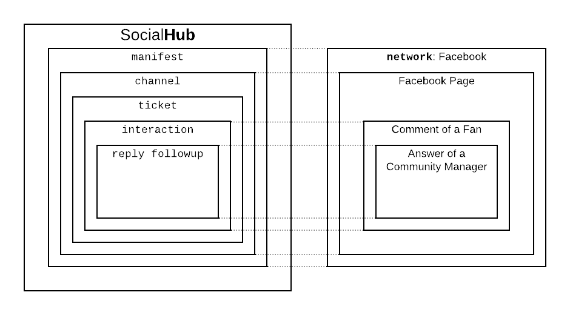

SocialHub provides various APIs allowing extension our products with additional functionality:

- **[REST APIs](rest.md)**    
  Allow create, read, update and delete (CRUD) operations to be executed via simple HTTP requests.
- **[WebHooks](webhooks.md)**    
  Allow receiving information about events that happened on SocialHub in near real time.

## Overview

* SocialHub is a social media software platform with products customers may use depending on their license.
* A customer has one `account` entity, which represents the customers organizational name space.
* An `account` can have multiple `user` entities with various roles.
* A `channel` entity represents a specific connection between the SocialHub and an external data source (eg. a Facebook page).
* External data sources are part of what we call `networks` (eg. Facebook) that are integrated into a SocialHub product by an `integration`.
* An `integration` is a program that synchronizes data between SocialHub products and a 3rd party network.
* A `channel` may have a `manifest` which defines a `networks` capabilities and configures communication with its `integration`.

### Inbox

* The Inbox is a product of the SocialHub software platform intended for centralized social media community management.
* When a user writes a message to a `channel` on a `network` (eg. a comment on a post of a Facebook page) we call it an `interaction`.
* The `interactions` are synchronized between a `network` and the Inbox by an `integration`.
* For each `interaction` a `ticket` entity is created, that SocialHub `users` with access to the Inbox can work on.
* Users can work on these `tickets` by applying "network-agnostic" actions to it. These are actions that do not cause any changes on the `network` (eg. assigning the `ticket` to a `user`).
* Depending on the Ticket's `network` there may also be "network-specific" actions available (eg. "liking" a comment `interaction` on Facebook).
* A `ticket` can contain multiple `followups`. A `followup` can be an internal `note` or a public `reply`.

### Other products

There are currently no APIs available for other SocialHub Platform products like the Content Planner or Meet.
